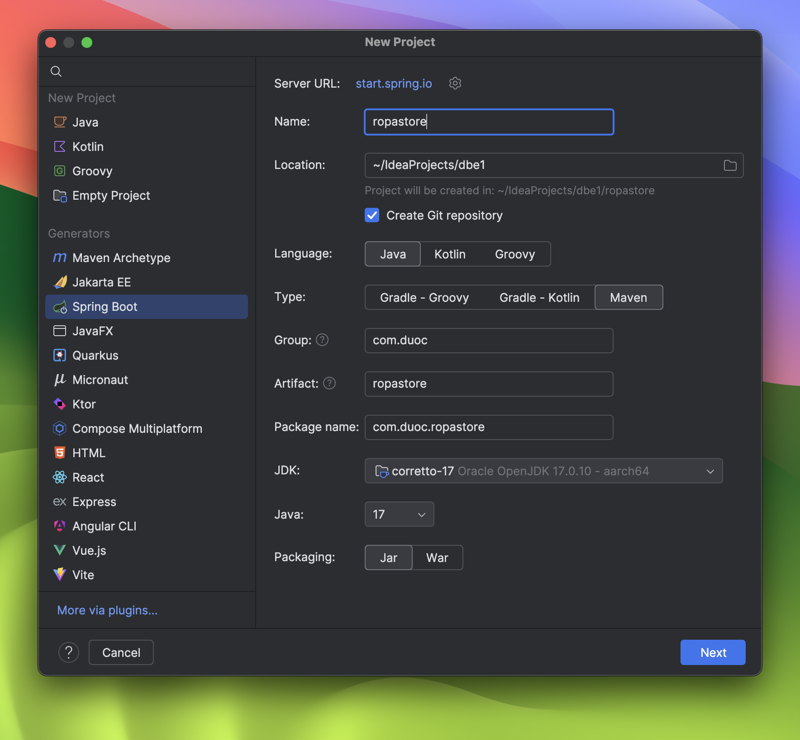
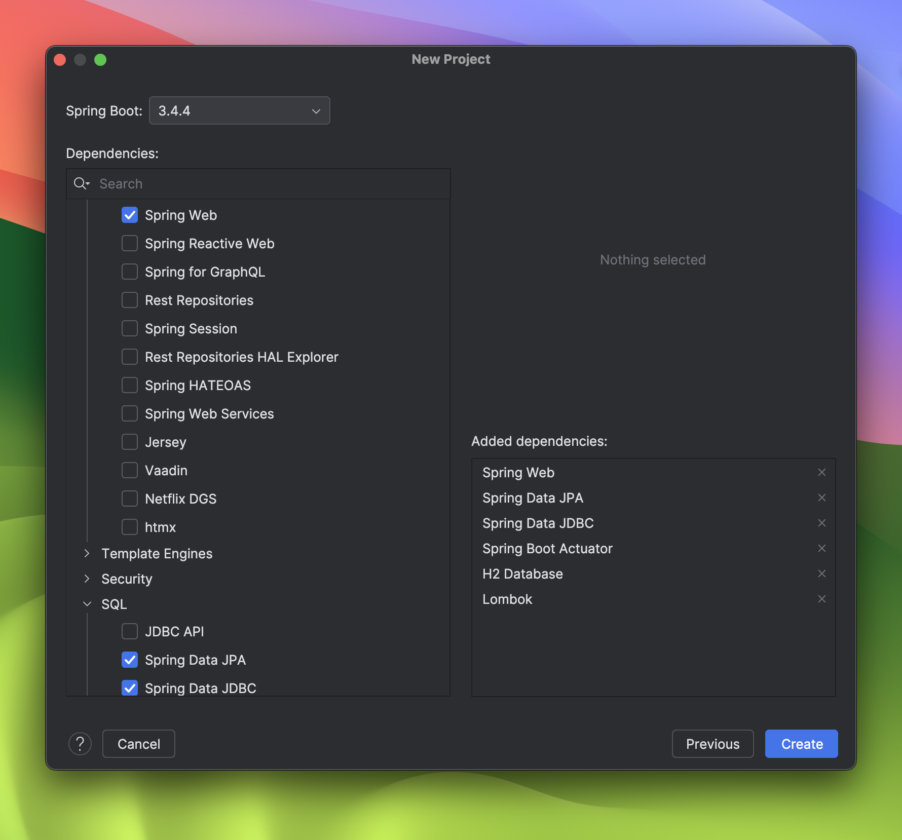
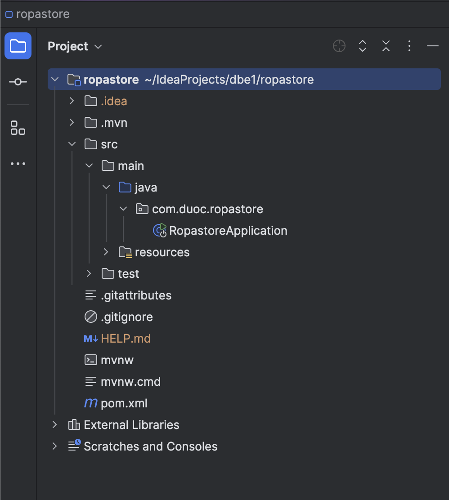
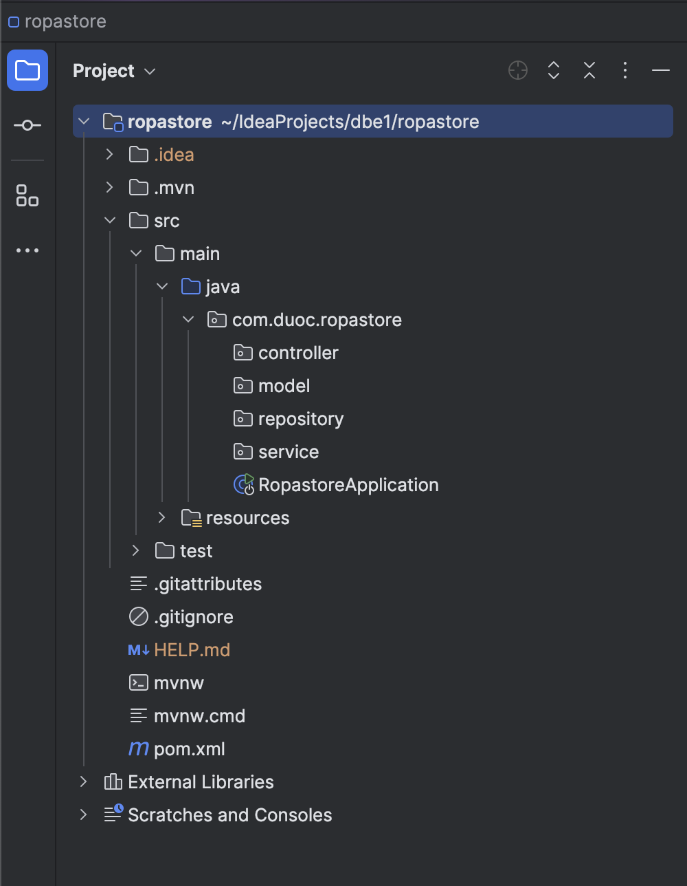
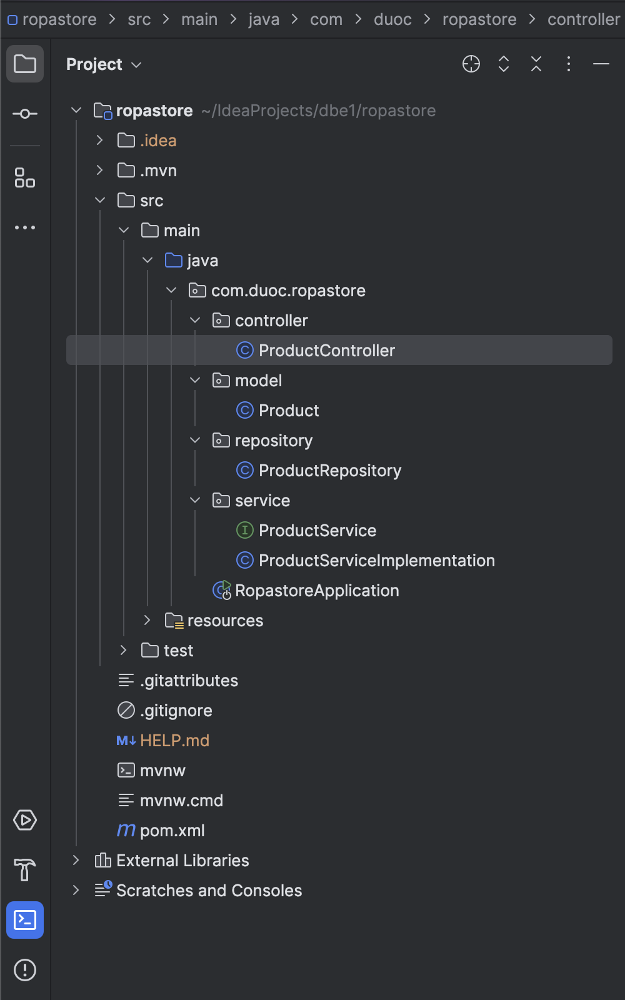

# Configurando microservicios con Spring

---


## Configuración inicial del proyecto en Spring Initializr

*Paso 1: Elegir la tecnología a usar e indicar los datos del proyecto.*


*Paso 2: Elegir las dependencias necesarias para el desarrollo del proyecto.*


*Estructura de carpetas al finalizar Spring Initializr*

## Estructura del proyecto en la IDE

*Creación de la estructura de capas del proyecto*


*Creación de los archivos para el desarrollo del proyecto utilizando la arquitectura definida.*


## Guia APIs

### Obtener todos los productos
```http
  GET localhost:8080/products
```

### Obtener los productos ordenados por nombre
```http
  GET localhost:8080/products/order-by-name
```

### Obtener los productos por categoría
```http
  GET localhost:8080/products/${category}
```

| Parameter | Type     | Description                       |
| :-------- | :------- | :-------------------------------- |
| `category`      | `string` | Usar categoría *clothing* |
